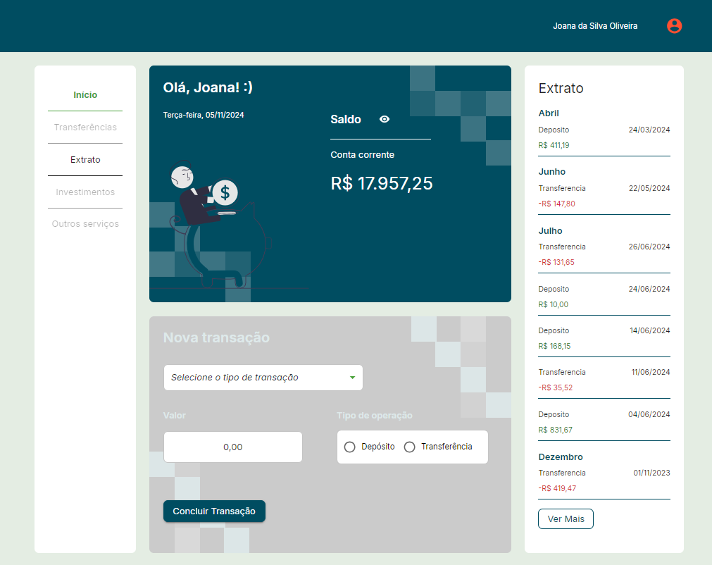
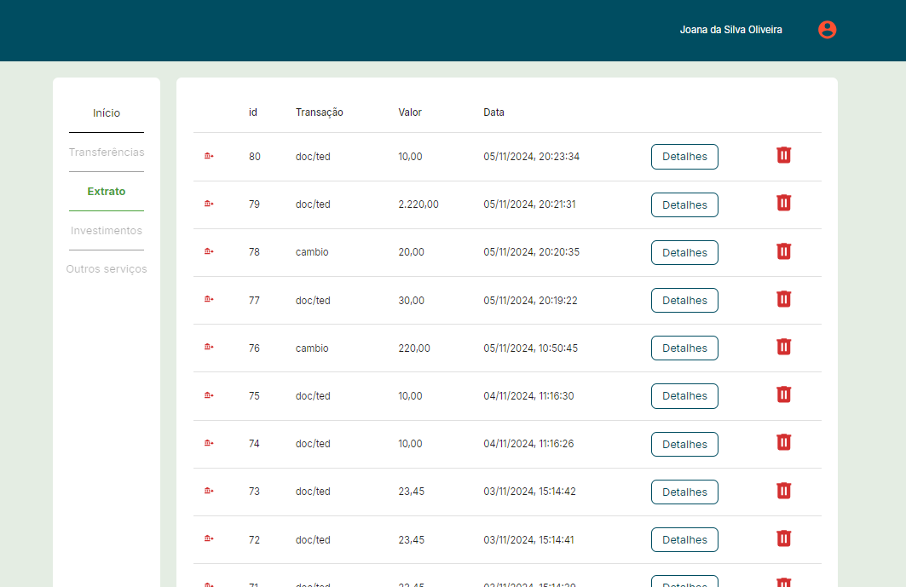
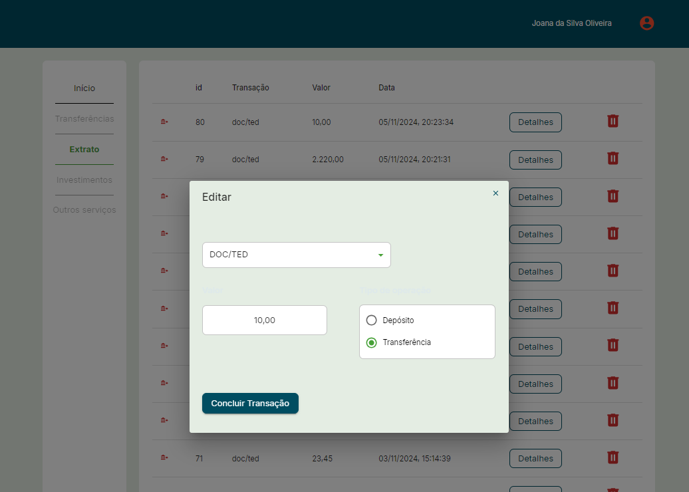
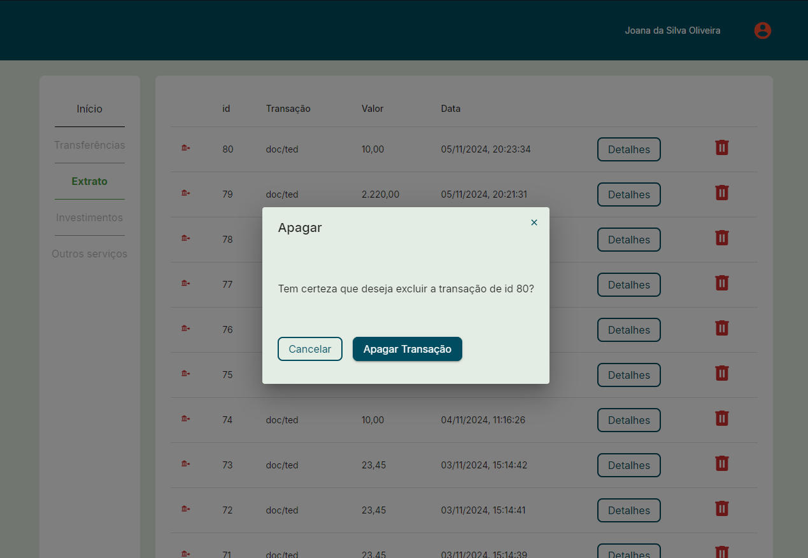
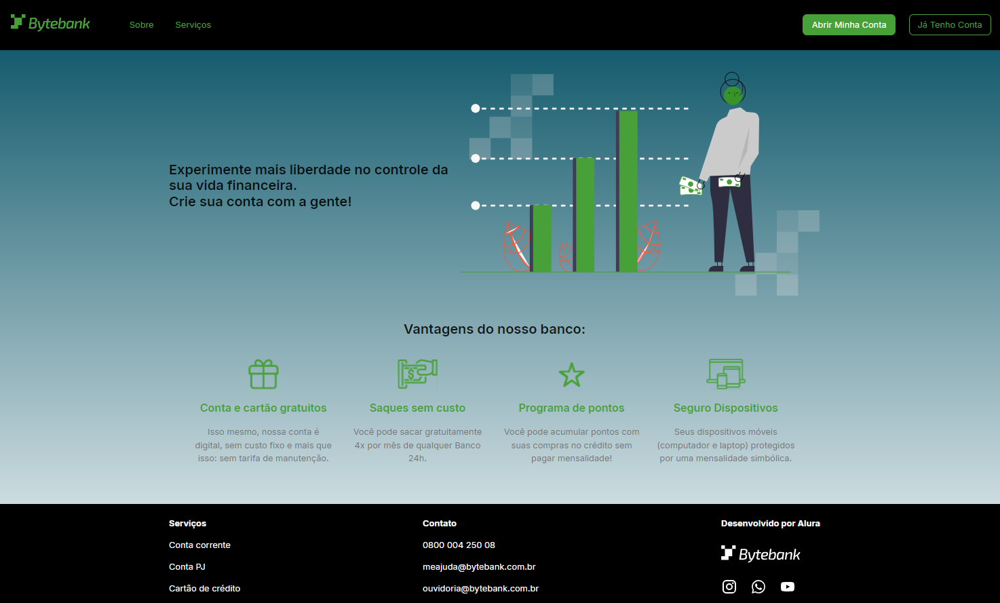
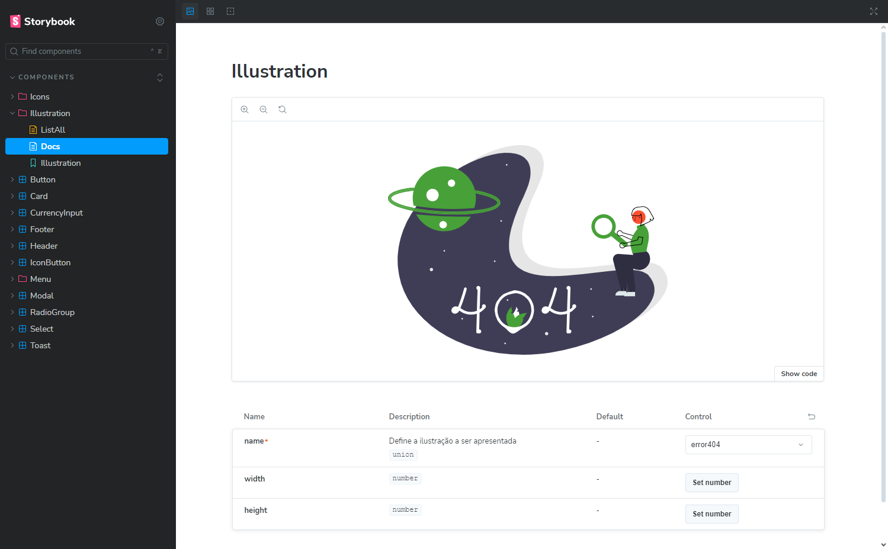

# Tech Challenge - Fase 1

## Projeto Financeiro

Projeto desenvolvido pelo Grupo 35:

- Cristiano Santos Gonçalves - RM 358858

- Isabella Soares de Lima - RM 358599

## Tecnologias utilizadas

- [Next.js](https://nextjs.org)
- [Turborepo](https://turbo.build)
- [Material UI](https://mui.com/material-ui/)
- [Storybook](https://storybook.js.org)
- [Vitest](https://vitest.dev)
- [Husky](https://typicode.github.io/husky/)
- [PNPM](https://pnpm.io/pt/)
- [MockAPI](https://mockapi.io/)
- [Vercel](https://vercel.com/home)

## Como executar o projeto

### Executar todos os projetos ao mesmo tempo

Instale as dependências na raiz do projeto com o comando:

```sh
pnpm i
```

Execute o seguinte comando na raiz do projeto para executar todos os projetos ao mesmo tempo:

```sh
pnpm run dev
```

Todos os projetos serão executados em portas diferentes.

### Executar os projetos de forma individual

Instale as dependências na raiz do projeto com o comando:

```sh
pnpm i
```

Para executar o projeto `dashboard` execute o seguinte comando na raiz do projeto:

```sh
pnpm run dev --filter=dashboard
```

Para executar o projeto `landing_page` execute o seguinte comando na raiz do projeto:

```sh
pnpm run dev --filter=landing_page
```

Para executar o projeto `ui`, do Design System, execute o seguinte comando na raiz do projeto:

```sh
pnpm run --filter="./packages/ui"
```

### Links para acessar os apps

[Dashboard](https://fiap-tech-challenge-dashboard.vercel.app/)

[LandingPage](https://desafio-projeto-financeiro-landing-page.vercel.app/)

[Storybook](https://desafio-projeto-financeiro-ui.vercel.app/?path=/docs/components-illustration--docs)

### Decisões de projeto

#### Dashboard



Optamos por criar uma tela de Extrato, onde o usuário pode visualizar todo o histórico das suas transações, assim como os detalhes de cada uma. Por conta disso, adicionamos no menu da página de Dashboard um link para a página de Extrato. No fim da listagem de transações, na seção de Extrato, também existe um botão "Ver mais" que direciona o usuário para a página completa do Extrato.

Os cards das transações também foram alterados. Acreditamos que faz mais sentido que as operações que podem ser realizadas sobre as transações (visualização, edição e deleção) estejam disponíveis somente na página de Extrato, dando mais significado para essa página, além de reduzir o volume de informações visuais na Dashboard.

Adicionamos na seção de "Nova transação" um componente onde o usuário escolhe se a operação é um Depósito ou uma Transferência, facilitando o processo de criação da transação, no qual decidimos se o valor deve ser somado ou subtraído do saldo total.

#### Página de Extrato



Conforme mencionado anteriormente, optamos por criar uma nova página Extrato onde o usuário consegue visualizar todo o histórico de transações. Nela também é possível visualizar os detalhes de uma transação, editá-la ou excluí-la do histórico.

##### Modal de visualização de detalhes e edição



##### Modal de deleção



#### Ajuste no menu mobile


Notamos que, no layout mobile, o link ativo tinha a cor laranja, diferente da cor verde utilizada como padrão em todos os outros layouts desse componente. Para manter consistência visual, decidimos manter o item ativo no meu mobile com a cor verde também.

#### Landing Page



Na Landing Page não realizamos alterações.

#### Storybook


